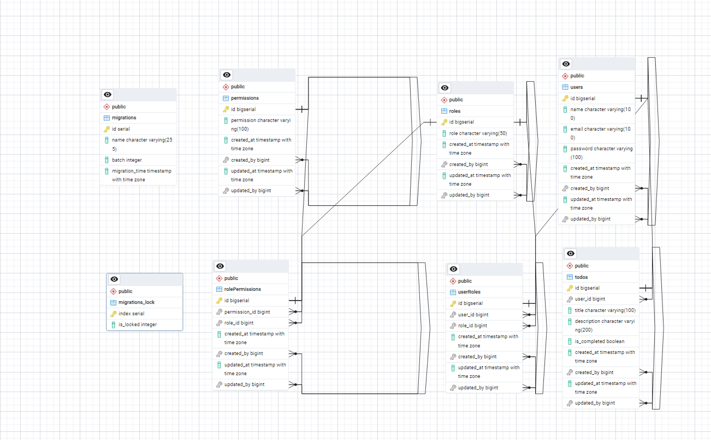

# NODE.JS Assignment7 (Todo App With Users) (API ONLY)

## ER Diagram



## Steps to locally setup

-   Install Node.js version 18 or above on your system, here is the link: [Node.js](https://nodejs.org/en)

```sh
    git clone https://github.com/Ganesh896/LF-Node-TodoAPP
    cd server

    # switch branch to todo-user
    git chekout assignment7

    npm install

    # Add in .env file
    PORT=3000
    JWT_SECRET='secret'

    # Finally run
    npm run start
```
